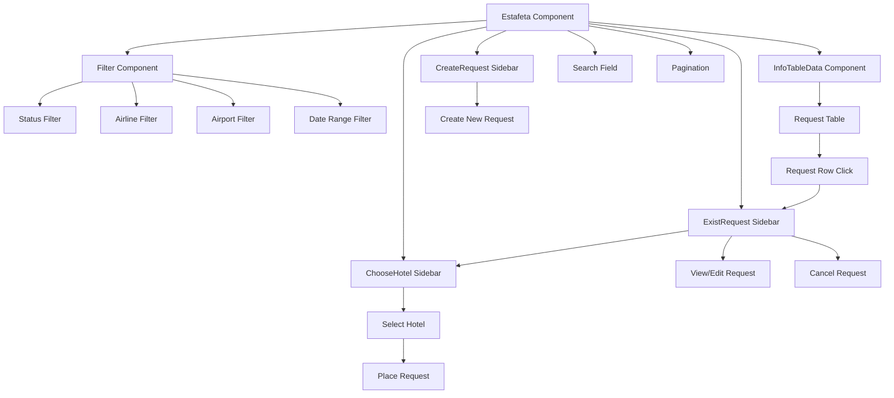
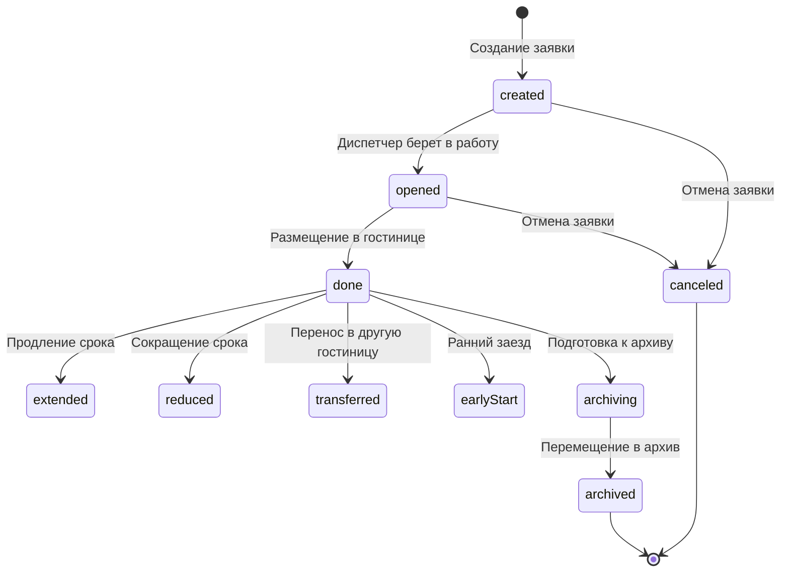
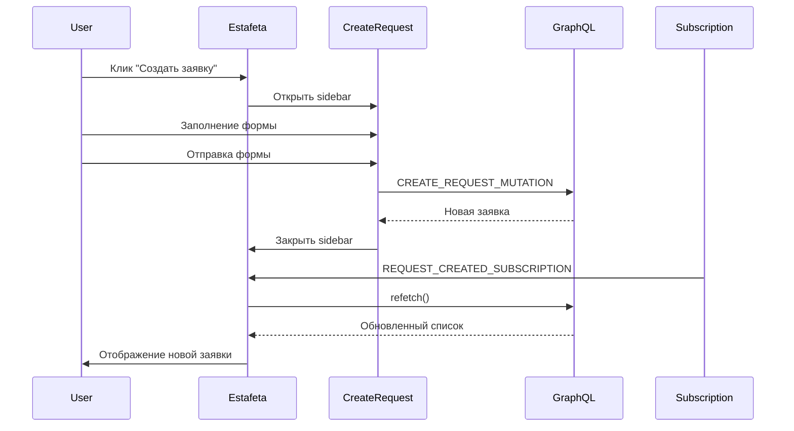
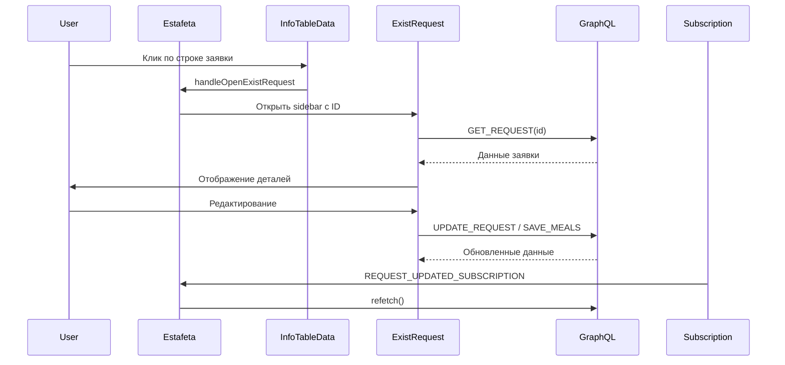
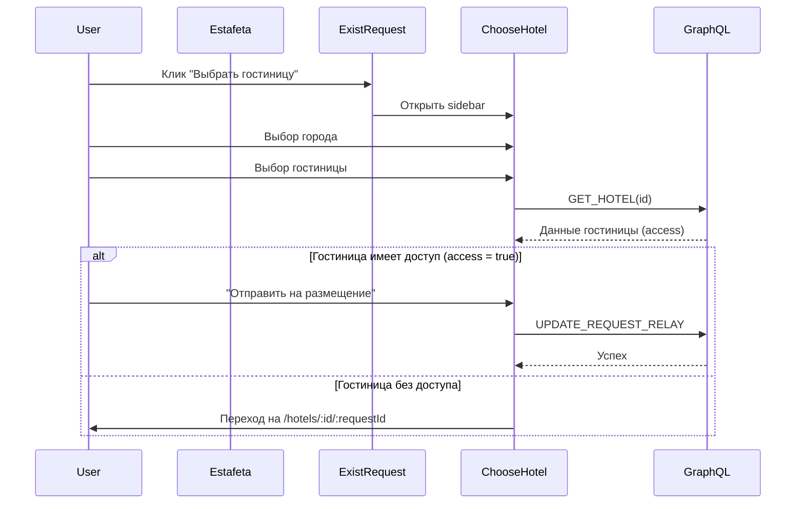
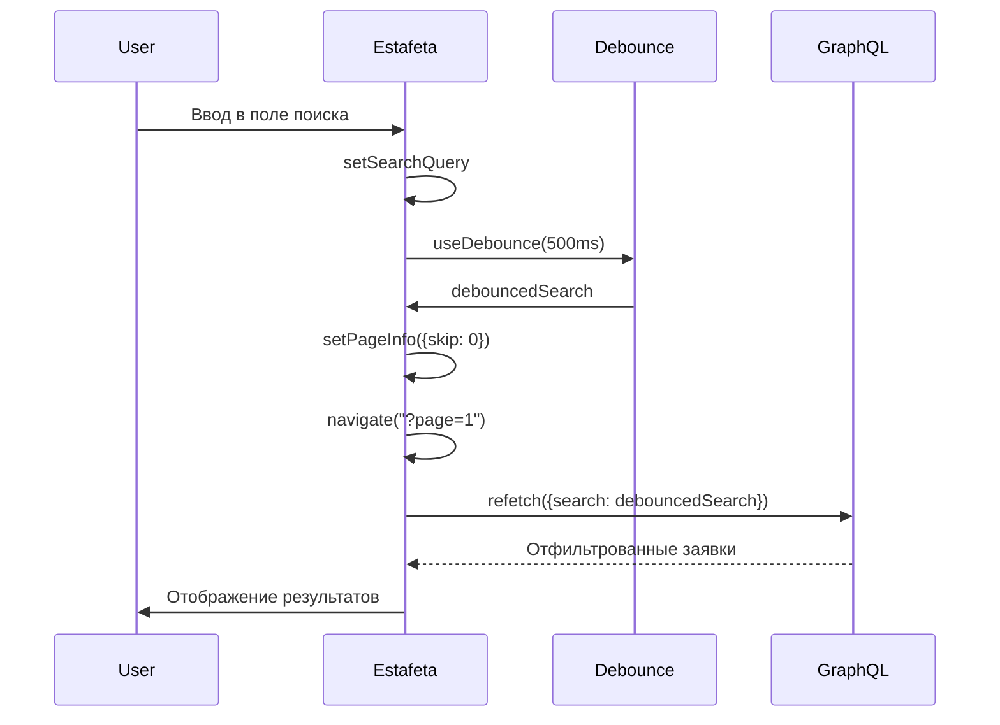

# Экскурс: Эскадрилья и система заявок в KARS-AVIA CRM

## 📋 Оглавление
1. [Обзор системы](#обзор-системы)
2. [Архитектура компонента Estafeta](#архитектура-компонента-estafeta)
3. [Жизненный цикл заявки](#жизненный-цикл-заявки)
4. [Компоненты системы](#компоненты-системы)
5. [GraphQL запросы и подписки](#graphql-запросы-и-подписки)
6. [Фильтрация и поиск](#фильтрация-и-поиск)
7. [Статусы заявок](#статусы-заявок)
8. [Права доступа](#права-доступа)
9. [Поток данных](#поток-данных)

---

## 🎯 Обзор системы

**Эскадрилья** (ранее "Эстафета") — это основной модуль системы управления заявками на размещение экипажа авиакомпаний в гостиницах. Компонент `Estafeta` (`src/Components/Blocks/Estafeta/Estafeta.jsx`) является центральным элементом для работы с заявками.

### Основные функции:
- Просмотр списка заявок с пагинацией
- Создание новых заявок
- Фильтрация по статусу, авиакомпании, аэропорту, датам
- Поиск по различным полям
- Просмотр и редактирование существующих заявок
- Размещение заявок в гостиницах
- Отмена заявок
- Архивация заявок

---

## 🏗️ Архитектура компонента Estafeta

### Основная структура



### Состояние компонента

**Основные состояния:**
- `requests` — массив заявок для отображения
- `filteredRequests` — отфильтрованные заявки (мемоизировано)
- `statusFilter` — текущий фильтр статуса (сохраняется в localStorage)
- `pageInfo` — информация о пагинации (skip, take: 50)
- `searchQuery` — строка поиска (с debounce 500ms)
- `selectedAirline` — выбранная авиакомпания
- `selectedAirport` — выбранный аэропорт
- `dateRange` — диапазон дат (startDate, endDate)

**Боковые панели:**
- `showCreateSidebar` — панель создания заявки
- `showRequestSidebar` — панель просмотра заявки
- `showChooseHotel` — панель выбора гостиницы
- `showDelete` — модальное окно подтверждения удаления

---

## 🔄 Жизненный цикл заявки

### Статусы заявки (из `src/roles.js`):

```javascript
statusMapping = {
  opened: "В обработке",
  canceled: "Отменен",
  done: "Размещен",
  created: "Создан",
  extended: "Продлен",
  reduced: "Сокращен",
  transferred: "Перенесен",
  earlyStart: "Ранний заезд",
  archiving: "Готов к архиву",
  archived: "Архив"
}
```

### Типичный жизненный цикл:



---

## 🧩 Компоненты системы

### 1. **Estafeta** (главный компонент)
**Файл:** `src/Components/Blocks/Estafeta/Estafeta.jsx`

**Ответственность:**
- Управление состоянием списка заявок
- Координация работы всех подкомпонентов
- Обработка GraphQL запросов и подписок
- Управление пагинацией и фильтрацией

**Ключевые функции:**
- `handleStatusChange` — изменение фильтра статуса
- `handleSearch` — обработка поискового запроса (с debounce)
- `handlePageClick` — переключение страниц
- `handleCancelRequest` — отмена заявки
- `handleOpenExistRequest` — открытие существующей заявки

### 2. **Filter** (компонент фильтрации)
**Файл:** `src/Components/Blocks/Filter/Filter.jsx`

**Функции:**
- Фильтрация по статусу (с сохранением в localStorage)
- Фильтрация по авиакомпании
- Фильтрация по аэропорту
- Фильтрация по диапазону дат
- Кнопка создания заявки (для определенных ролей)

**Особенности:**
- Разные наборы статусов для разных ролей (SuperAdmin, DispatcherAdmin, HotelAdmin)
- Адаптивная ширина выпадающих списков
- Интеграция с MUI Autocomplete

### 3. **InfoTableData** (таблица заявок)
**Файл:** `src/Components/Blocks/InfoTableData/InfoTableData.jsx`

**Отображает:**
- Номер заявки
- ФИО сотрудника
- Дата создания заявки
- Авиакомпания
- Аэропорт
- Дата/время прибытия
- Дата/время отъезда
- Статус

**Функции:**
- Клик по строке открывает `ExistRequest`
- Визуальное выделение активной заявки
- Индикатор непрочитанных сообщений
- Автопрокрутка при смене страницы

### 4. **CreateRequest** (создание заявки)
**Файл:** `src/Components/Blocks/CreateRequest/CreateRequest.jsx`

**Функции:**
- Создание новой заявки через GraphQL мутацию `CREATE_REQUEST_MUTATION`
- Выбор сотрудника авиакомпании
- Выбор аэропорта
- Указание дат прибытия/отъезда
- Настройка плана питания
- Проверка на дубликаты заявок
- Отображение существующих бронирований сотрудника

**Особенности:**
- Валидация формы перед отправкой
- Предупреждение о несохраненных изменениях
- Обработка ошибок (включая обнаружение дубликатов)
- Уведомления об успешном создании

### 5. **ExistRequest** (просмотр/редактирование заявки)
**Файл:** `src/Components/Blocks/ExistRequest/ExistRequest.jsx`

**Функции:**
- Просмотр детальной информации о заявке
- Редактирование дат (продление/сокращение)
- Редактирование плана питания
- Просмотр истории изменений (логи)
- Отмена заявки
- Переход к размещению в гостинице
- Чат по заявке

**Вкладки:**
- "Общая" — основная информация
- "Питание" — настройка питания
- "История" — логи изменений

### 6. **ChooseHotel** (выбор гостиницы)
**Файл:** `src/Components/Blocks/ChooseHotel/ChooseHotel.jsx`

**Функции:**
- Выбор города
- Выбор гостиницы в выбранном городе
- Авторазмещение (если у гостиницы есть доступ `access`)
- Переход к размещению через диспетчера (если нет доступа)

**Особенности:**
- Фильтрация гостиниц по городу
- Проверка прав гостиницы на саморазмещение
- Навигация на страницу размещения (`/hotels/:hotelId/:requestId`)

---

## 🔌 GraphQL запросы и подписки

### Основные запросы

#### 1. **GET_REQUESTS** — получение списка заявок
```graphql
query Requests($pagination: PaginationInput) {
  requests(pagination: $pagination) {
    totalCount
    totalPages
    requests {
      id
      requestNumber
      person { ... }
      airline { ... }
      airport { ... }
      arrival
      departure
      status
      mealPlan { ... }
      hotelChess { ... }
      chat { ... }
    }
  }
}
```

**Параметры пагинации:**
- `skip` — количество пропущенных записей
- `take` — количество записей на странице (50)
- `status` — массив статусов для фильтрации
- `airlineId` — ID авиакомпании
- `airportId` — ID аэропорта
- `arrival` — дата прибытия (ISO string)
- `departure` — дата отъезда (ISO string)
- `search` — строка поиска

#### 2. **GET_REQUESTS_ARCHIVED** — получение архивных заявок
Аналогичен `GET_REQUESTS`, но для архива.

#### 3. **GET_REQUEST** — получение одной заявки
Используется в `ExistRequest` для детального просмотра.

#### 4. **CREATE_REQUEST_MUTATION** — создание заявки
```graphql
mutation CreateRequest($input: CreateRequestInput!) {
  createRequest(input: $input) {
    id
    requestNumber
    status
    ...
  }
}
```

#### 5. **CANCEL_REQUEST** — отмена заявки
```graphql
mutation CancelRequest($cancelRequestId: ID!) {
  cancelRequest(id: $cancelRequestId) {
    id
    status
  }
}
```

#### 6. **UPDATE_REQUEST_RELAY** — обновление заявки
Используется для размещения заявки в гостинице.

### Подписки (Subscriptions)

#### 1. **REQUEST_CREATED_SUBSCRIPTION**
Подписка на создание новых заявок. При получении события вызывается `refetch()`.

#### 2. **REQUEST_UPDATED_SUBSCRIPTION**
Подписка на обновление заявок. При получении события вызывается `refetch()`.

**Примечание:** В текущей версии обработка подписок упрощена — просто вызывается `refetch()` вместо локального обновления состояния.

---

## 🔍 Фильтрация и поиск

### Фильтрация

**Многоуровневая фильтрация:**
1. **По статусу** — через `statusFilter` (сохраняется в localStorage)
2. **По авиакомпании** — через `selectedAirline`
3. **По аэропорту** — через `selectedAirport`
4. **По датам** — через `dateRange` (startDate, endDate)

**Логика фильтрации:**
- Фильтры применяются на сервере через параметры GraphQL запроса
- При изменении любого фильтра сбрасывается пагинация на первую страницу
- URL синхронизируется с пагинацией (`?page=1`)

### Поиск

**Реализация:**
- Поиск с debounce 500ms (через хук `useDebounce`)
- Поиск выполняется на сервере через параметр `search` в GraphQL запросе
- Поиск по полям:
  - Номер заявки
  - ФИО сотрудника
  - Номер телефона
  - Должность
  - Пол
  - Название авиакомпании
  - Название аэропорта
  - Код аэропорта
  - Даты прибытия/отъезда
  - Статус (и его отображаемое название)

**Локальная фильтрация:**
- Дополнительно применяется локальная фильтрация через `filteredRequests` (useMemo)
- Фильтрует по `filterData.filterSelect` (авиакомпания) и `filterData.filterDate` (дата создания)

---

## 📊 Статусы заявок

### Маппинг статусов

Статусы хранятся в базе данных в английском формате, но отображаются на русском через `statusMapping` из `src/roles.js`.

### Фильтры по статусам

**Для SuperAdmin/DispatcherAdmin/AirlineAdmin:**
- Все заявки
- Создан
- В обработке
- Размещен
- Готов к архиву
- Архивные
- Отменен

**Для HotelAdmin:**
- Все заявки
- Создан
- В обработке
- Размещен
- Готов к архиву
- Отменен

### Логика работы со статусами

- При выборе статуса "Архивные" используется запрос `GET_REQUESTS_ARCHIVED`
- Для остальных статусов используется `GET_REQUESTS` с параметром `status`
- Статус фильтра сохраняется в `localStorage` для сохранения выбора пользователя

---

## 🔐 Права доступа

### Роли пользователей

**Из `src/roles.js`:**
- `SUPERADMIN` — суперадминистратор
- `DISPATCHERADMIN` — администратор диспетчера
- `AIRLINEADMIN` — администратор авиакомпании
- `HOTELADMIN` — администратор гостиницы
- `DISPATCHERMODERATOR` — модератор диспетчера
- `AIRLINEMODERATOR` — модератор авиакомпании
- `HOTELMODERATOR` — модератор гостиницы

### Права доступа через `accessMenu`

**Структура `accessMenu`:**
```javascript
{
  requestMenu: true/false,      // Доступ к меню заявок
  requestCreate: true/false,    // Создание заявок
  requestUpdate: true/false,    // Редактирование заявок
  requestChat: true/false,     // Чат по заявкам
  // ... другие права
}
```

**Логика отображения:**
- Кнопка "Создать заявку" показывается если:
  - У пользователя нет `airlineId` ИЛИ
  - Есть право `accessMenu.requestCreate`
- Фильтр по авиакомпании скрыт для `AIRLINEADMIN` (видит только свою авиакомпанию)

---

## 🌊 Поток данных

### Создание заявки



### Просмотр и редактирование заявки



### Размещение заявки в гостинице



### Фильтрация и поиск



---

## 📝 Ключевые особенности реализации

### 1. Пагинация
- Синхронизация с URL (`?page=1`)
- Автоматическая установка `?page=1` при открытии `/relay`
- Валидация текущей страницы (не больше totalPages)
- Размер страницы: 50 записей

### 2. Управление состоянием
- Использование React hooks (useState, useEffect, useMemo, useCallback)
- Мемоизация фильтрованных заявок для оптимизации
- Сохранение фильтра статуса в localStorage

### 3. Обработка ошибок
- Обработка ошибок GraphQL запросов
- Обнаружение дубликатов заявок при создании
- Уведомления пользователю через компонент `Notification`

### 4. Производительность
- Debounce для поиска (500ms)
- Мемоизация вычислений (useMemo)
- Оптимизация ре-рендеров через useCallback
- Ленивая загрузка данных через GraphQL

### 5. UX особенности
- Автопрокрутка при смене страницы
- Визуальное выделение активной заявки
- Индикаторы непрочитанных сообщений
- Предупреждения о несохраненных изменениях
- Модальные окна подтверждения для критических действий

---

## 🔗 Связанные компоненты и маршруты

### Роутинг

**Использование Estafeta:**
- `/relay` — прямой доступ к эскадрилье
- Главная страница (если есть `requestMenu` в `accessMenu`)

**Связанные маршруты:**
- `/hotels/:hotelId/:requestId` — размещение заявки в гостинице
- `/newPlacement/:hotelId` — новая шахматка размещения

### Интеграция с другими модулями

1. **Резерв** (`Reserve`) — альтернативный модуль для массовых заявок
2. **Трансферы** (`TransferOrders`) — заявки на трансфер
3. **Представительские заявки** (`RepresentativeRequests`) — специальные заявки
4. **Аналитика** — статистика по заявкам
5. **Отчеты** — генерация отчетов по заявкам

---

## 🐛 Известные особенности и комментарии в коде

### Закомментированный код

1. **Обработка подписок** (строки 131-156, 184-186):
   - Старая логика локального обновления состояния закомментирована
   - Сейчас используется простой `refetch()` при получении события

2. **Поиск** (строки 237-288):
   - Несколько версий реализации поиска закомментированы
   - Текущая версия использует debounce и серверный поиск

3. **Локальная фильтрация** (строки 452-453):
   - Фильтрация по авиакомпании и аэропорту закомментирована в `filteredRequests`
   - Фильтрация выполняется на сервере

### Потенциальные улучшения

1. Оптимизация подписок — вернуть локальное обновление состояния
2. Кэширование результатов поиска
3. Виртуализация списка заявок для больших объемов данных
4. Оптимизация количества запросов при изменении фильтров

---

## 📚 Дополнительные ресурсы

### Файлы для изучения:
- `src/Components/Blocks/Estafeta/Estafeta.jsx` — главный компонент
- `src/Components/Blocks/InfoTableData/InfoTableData.jsx` — таблица заявок
- `src/Components/Blocks/CreateRequest/CreateRequest.jsx` — создание заявки
- `src/Components/Blocks/ExistRequest/ExistRequest.jsx` — просмотр заявки
- `src/Components/Blocks/Filter/Filter.jsx` — фильтрация
- `src/Components/Blocks/ChooseHotel/ChooseHotel.jsx` — выбор гостиницы
- `graphQL_requests.js` — все GraphQL запросы
- `src/roles.js` — роли и статусы

### Связанные модули:
- `src/Components/PlacementDND/` — модуль размещения (шахматка)
- `src/Components/Blocks/Reserve/` — модуль резерва
- `src/Components/RoleContent/` — контент для разных ролей

---

**Дата создания:** 2025-01-27  
**Версия системы:** Текущая (на основе анализа кода)
